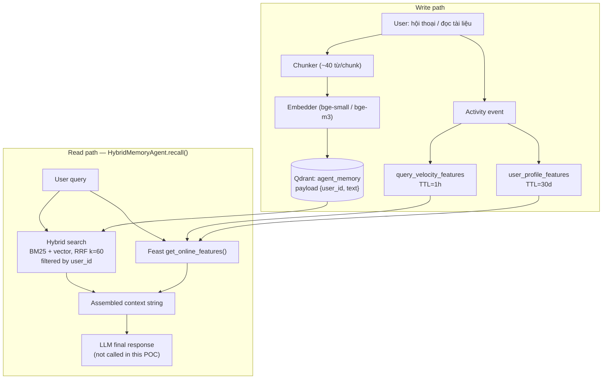

# Kiến trúc — Hybrid Memory cho trợ lý AI cá nhân (VN)

**Contributors:** Lê Trung Kiên

## 1. Bài toán

Trợ lý AI cá nhân cho người dùng Việt Nam cần nhớ 3 loại thông tin có tốc độ
thay đổi khác nhau: **episodic memory** (hội thoại, tài liệu đã đọc — thay
đổi liên tục, cần tìm kiếm ngữ nghĩa), **stable profile** (ngôn ngữ ưu tiên,
tốc độ đọc, lĩnh vực quan tâm — gần như tĩnh), và **recent activity** (query
1 giờ qua — thay đổi theo phút). POC này (`bonus/agent.py`) ghép Vector Store
(Qdrant) cho episodic memory với Feature Store (Feast, tái dùng
`app/feast_repo/`) cho 2 loại còn lại.

## 2. Sơ đồ kiến trúc

## 3. Ba quyết định kiến trúc

### 3.1 Chunking strategy — gói theo câu, ~40 từ/chunk, không overlap

**Tradeoff:** chunk nhỏ (per-message) cho retrieval quality cao hơn (mỗi
vector = 1 ý rõ ràng) nhưng số lượng vector và storage cost tăng tuyến tính;
chunk lớn (per-conversation) rẻ hơn, ít vector hơn, nhưng 1 vector trung
bình hoá nhiều ý khác nhau → recall kém khi user hỏi về 1 chi tiết nhỏ giữa
đoạn hội thoại dài, và tốn context window hơn khi chunk đó được nhét vào
prompt cuối cùng.

**Chọn X vì:** tôi chọn gói theo câu, cap ~40 từ/chunk, không cắt giữa câu —
điểm cân bằng giữa 2 cực trên. Không overlap vì đây là ghi chú/tài liệu đã
đọc (không phải transcript hội thoại trôi chảy), nên mất ngữ cảnh biên câu ít
rủi ro hơn so với RAG trên văn bản dài. Đây chính là tradeoff *retrieval
quality vs storage cost vs context window* mà NB1 (batch embed) và NB5
(over-fetch ladder) đã minh hoạ ở quy mô corpus.

### 3.2 Feature schema — tabular, không dùng embedding feature cho profile

Tôi dùng schema tabular có sẵn trong `app/feast_repo/feature_views.py`
(`topic_affinity`, `preferred_language`, `reading_speed_wpm`) thay vì một
latent embedding vector đại diện sở thích user trong Feast.

**Tradeoff:** tabular dễ diễn giải và debug — `get_online_features()` trả về
giá trị người đọc được ngay, dễ viết đúng TTL theo business semantics (đây
là "think-hard zone" theo VIBE-CODING.md). Embedding feature (latent
preference học từ lịch sử) biểu diễn được sở thích tinh vi hơn nhưng khó
debug khi sai, và trộn 2 concern — episodic embedding (Qdrant) và preference
embedding (Feast) — vào chung 1 kiến trúc.

**Chọn X vì:** ở quy mô POC, tín hiệu tabular (5 topic category + tốc độ đọc)
đã đủ để cá nhân hoá `recall()` rõ rệt, và pattern này khớp production thật —
các hệ recommendation lớn vẫn dùng tabular feature làm baseline trước khi
thêm embedding feature ở stage sau.

### 3.3 Freshness strategy — 3 tốc độ cho 3 loại dữ liệu

- **Episodic memory mới** (vừa đọc xong 1 tài liệu) → cần phản ánh **ngay**
  (sub-second): không đi qua Feast, `remember()` upsert thẳng vào Qdrant,
  không có batch delay.
- **`query_velocity_features`** (hoạt động 1 giờ qua) → TTL=1h, refresh bằng
  `materialize-incremental` chạy mỗi vài phút — streaming-friendly, đúng
  pattern NB4 (fraud-detection-style cadence). TTL sai (vd 30 ngày) sẽ pha
  loãng tín hiệu "hoạt động gần đây" bằng dữ liệu cũ.
- **`user_profile_features`** (topic_affinity, ngôn ngữ) → TTL=30d, batch
  refresh hàng ngày là đủ vì sở thích ổn định, không đổi nhanh.

Điểm mấu chốt: 3 use case dùng 3 pipeline khác nhau (in-process upsert /
streaming materialize / daily batch), không phải một pipeline "one-size-fits-
all" — đây trực tiếp là bài học TTL của NB4.

## 4. Lựa chọn bị loại bỏ

Tôi xem xét lưu episodic memory ngay trong Feast, như một embedding feature
view (tương tự `item_popularity_features`), để chỉ cần một hệ truy vấn duy
nhất. **Tôi loại bỏ vì re-index cycle khác hẳn nhau:** episodic memory cần
insert real-time — user vừa nói 1 câu phải retrieve được ngay — trong khi
`materialize-incremental` của Feast là pipeline batch/streaming thiết kế cho
feature có TTL và refresh cadence rõ ràng (giờ/ngày), không phải
insert-rồi-query-ngay-lập-tức. Ép episodic memory vào Feast sẽ làm chậm
`remember()` (phải chờ materialize) hoặc buộc viết riêng một Push API phức
tạp hơn hẳn việc tách 2 hệ thống (Qdrant cho episodic, Feast cho profile) và
join chúng ở tầng application trong `recall()`.

## 5. Vietnamese-context considerations

- **Code-switching (vi/en mix):** người dùng VN hay viết "Cho tôi summary
  cloud security" — nửa Việt nửa Anh trong cùng 1 câu. Whitespace tokenizer
  (BM25 hiện tại, giống `app/search.py`) vẫn chạy được vì không cần word
  segmentation, nhưng bỏ lỡ các từ ghép tiếng Việt không tách rõ theo dấu
  cách. Production nên dùng `underthesea`/`pyvi` — lab chính đã flag đây là
  quyết định "think-hard", không phải mặc định an toàn.
- **Embedding model:** `bge-small-en` (mặc định lite path) yếu trên câu hỏi
  tiếng Việt diễn đạt lại (NB2 đo recall 24-32% trên paraphrase). Với một
  trợ lý cá nhân thật cho người dùng VN, bắt buộc đổi sang `bge-m3` hoặc
  `multilingual` (`EMBEDDING_BACKEND` trong `.env`), nếu không recall trên
  câu hỏi tiếng Việt tự nhiên sẽ rất kém.
- **Privacy / Nghị định 13 về bảo vệ dữ liệu cá nhân:** vì đây là memory cá
  nhân, filter theo `user_id` trong payload Qdrant chỉ là cô lập **logic**,
  không phải cô lập vật lý. Production ở VN cần thêm mã hoá at-rest, audit
  log truy cập, và cơ chế xoá dữ liệu theo yêu cầu (right to erasure) — POC
  này **chưa** làm (xem mục 6).

## 6. What this POC doesn't handle yet

- Không cô lập vật lý giữa user — chỉ filter payload, chưa mã hoá dữ liệu.
- Không có CRUD (xoá/sửa 1 memory cụ thể), không có multi-device sync.
- Chunking không overlap — có thể mất ngữ cảnh biên câu với hội thoại dài.
- `_by_user` (dùng để rebuild BM25) giữ trong RAM, không persist — restart
  mất index BM25 (Qdrant vẫn còn dữ liệu nhưng phải rebuild BM25 từ payload).
- Chưa test ở quy mô >100 user hay >10k memory/user — rebuild BM25 mỗi lần
  gọi `recall()` sẽ không scale tới đó; cần cache hoặc BM25 incremental.

## 7. Vibe-coding workflow log (~100 từ)

Prompt hiệu quả nhất: yêu cầu AI đọc `app/search.py` và `app/agent.py`
(`build_context()`) trước, rồi tái dùng đúng pattern RRF/Feast-lookup thay vì
generate từ đầu — kết quả nhất quán với lab chính, ít bug hơn hẳn so với
prompt "viết 1 agent nhớ được hội thoại" không có context. Prompt kém hiệu
quả: hỏi thẳng "chunking strategy nào tốt nhất" mà không cho biết corpus
size/latency budget — câu trả lời chung chung, phải hỏi lại có ràng buộc cụ
thể (per-note text, ~100 user) mới ra được quyết định 40-từ/chunk ở trên.
